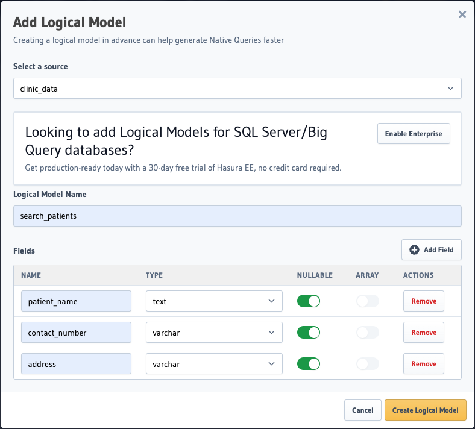
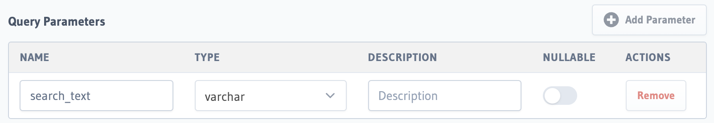
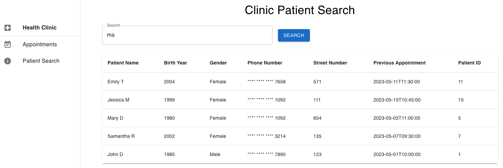

# Logical Models in Hasura
This workshop covers logical models and native query basics. This repo contains examples of native queries and logical models backed by a mock healthcare database. 

The accompanying slide deck can be found here: [Logical Models Workshop Slides](https://docs.google.com/presentation/d/1BnJuorqeWAtzMuwQmqTHurNc8PLOpE2A78dui9Kk5tA/edit?usp=sharing)

## Getting Started Guide
1. Use `docker compose up -d` to pull images and spin up container.
2. Execute `data-init` scripts within your [Hasura instance's SQL interface](http://localhost:8080/console/data/sql).
3. Navigate to `/frontend/clinic-search`. In a new terminal window run `npm install` to install frontend dependencies from `package.json`.
4. In that same terminal window run `npm start` to start the React frontend server. By default this should be viewable on [http://localhost:3000](http://localhost:3000)
5. Return to your Hasura instance and head over to the ["Logical Models" tab](http://localhost:8080/console/data/native-queries/logical-models). Click *Add Logical Model*. We will build a search function to be used in our frontend application.
6. We are going to be modeling our GraphQL API response data before we build the actual query. Select the `clinic_data` source, name the Logic Model "search_patients", and add the return Fields as shown: Click *Create Logical Model*.
7. 
8. Now let's head over to the ["Native Queries" tab](http://localhost:8080/console/data/native-queries)
9. Name the native query "*search_patients*" and write and optional description. Select the `clinic_data` database.
10. We will need search text as input to our search function. Add a Query Parameter as follows: 
11. Paste the SQL below in the "Native Query Statement" window 
```sql
SELECT CONCAT(first_name, ' ', last_name) 
AS patient_name, contact_number, address 
FROM patients 
WHERE first_name ILIKE '%' || {{search_text}} || '%'
   OR last_name ILIKE '%' || {{search_text}} || '%'
   OR address ILIKE '%' || {{search_text}} || '%'
   OR contact_number ILIKE '%' || {{search_text}} || '%';
```
12.  Now let's select our logical model and hit *Save*.
13.  Repeat for each logical model and native query you'd like to add. This repo alreday contains 3 examples of logical models.
14. Now that the search function is available to the front-end, let's head back to the frontend UI and see it in action. [http://localhost:3000](http://localhost:3000).
It should look like this: 


## Data Model
This demo repo is comprised of a database with the following schema:
- `doctors`: table with mock doctors data
- `patients`: table with mock patients data
- `appts`: table with clinic appointment data references `doctors` and `patients` tables
- `records`: table with clinic records data referencing `doctors` and `patients` tables


## Docs
- [Logical Models docs](https://hasura.io/docs/latest/schema/postgres/logical-models/index/).
- [Native Queries docs](https://hasura.io/docs/latest/schema/postgres/logical-models/native-queries/).


*Disclaimer:
This example is for demonstration purposes only and should not be used in a production environment.*


## To be completed
- [ ] use mssql to host doctors and patients data
- [ ] Shorten guide


